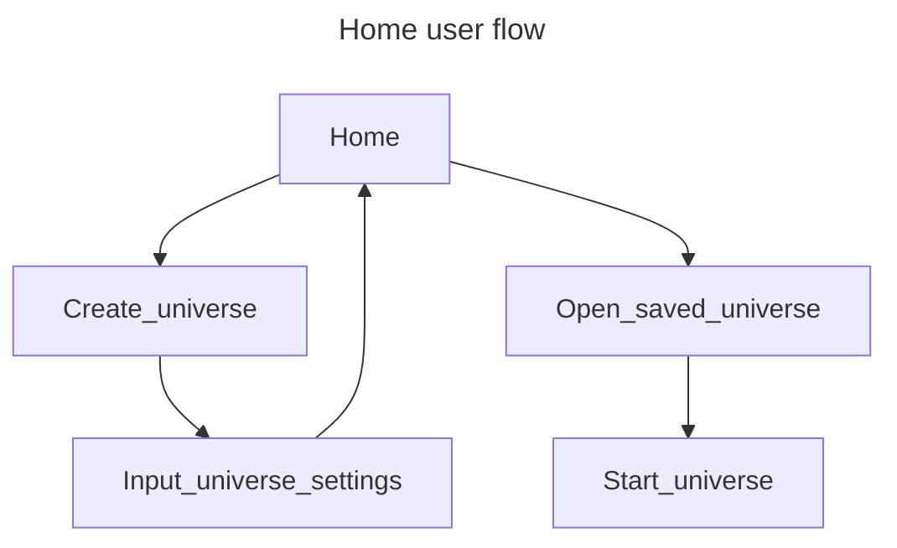
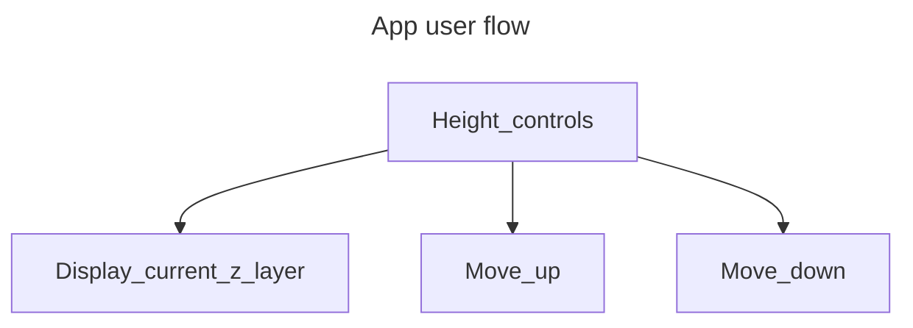

# Let there be light
And there was light. This is the first version release plan for the ecosystem simulator Myrmex. This update will start with the most basic building blocks for the simulated world. The objective of this version is to simulate the daily cycle of the universe.

## User Stories
- [x] Create a new universe, produce a save file.
- Observe all layers of the universe individually.
- [x] (Cancelled) Control the flow of time.
- Set the speed of the flow of time.
- Select an individual block in the universe.
- Read an individual block's properties.
- Change the selected block from one type to another.
- [x] (Cancelled) Save the map as a separate file.

## Rules
- The universe is created by defining its width, length, and height dimensions.
- Time is segmented in advancements of one second. 
- The speeds of the flow of time should be:
	- `Real time minimum` This means every game tick will last one "real-life" second as a minimum. It is stated to be a "minimum" for the possibility where the program requires too much CPU resources that it would take more than a second to compute all changes in the universe.
	- `As fast as possible` This means that as soon as one universe tick is done being computed, the next one will start immediately.
- The universe's shape is a rectangular prism with walls that must be solid, impossible for anything to interact with them.
- The universe's gravity will always be approximate to Earth's average. It must be a 90 degree vector pointing down.
- Include a bedrock layer in the bottom of the universe.
- Include a day/night cycle that lasts 86,400 seconds.
- Include a year cycle of 365 days.
- Include seasonal changes through the year:
	- Humidity changes through the year including rain as falling water blocks.
	- Sunrise and sunset times through the year.
	- Temperature changes.
- Temperature and humidity must bust be transferred between blocks.

### Nice to have
- The projected light changes angle through the day and blocks cast different shapes of shadows. *If it is not possible, make light rays 90 degree vectors pointing down.*

## Diagrams

